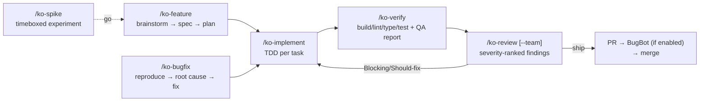

# ko-dev-kit

A CLI that scaffolds **Cursor** configuration for FE/BE/design-system engineering repos. It
detects the repo's archetype and installs matching Cursor resources — slash commands, skills,
subagents, a rule, an `AGENTS.md`, a privacy hook, and MCP/CLI config — into the project's
`.cursor/` (plus a root `AGENTS.md`).

Covers five engineering archetypes: `fe-nx`, `nestjs-graphql`, `design-system`, `nextjs-app`, `react-app`. Behavior —
detection, manifest tracking, pruning, exports — is driven by the scaffolding engine at
`src/scaffold-core/`.

Built for Kmart/Target AU monorepos but generic enough for any TypeScript project.

## Archetypes

| Archetype | Stack | Detected by |
|---|---|---|
| `fe-nx` | TypeScript + pnpm + **Nx** + Next.js 15 + styled-components + Apollo Client | `nx.json`, or an `@nx/*` / `@nrwl/*` dependency |
| `nestjs-graphql` | **NestJS** CLI monorepo + Apollo Federation + Lambda workers | `@nestjs/core` **plus** `nest-cli.json` or `@nestjs/graphql` |
| `design-system` | **Storybook 10 + MUI v6** multi-brand component library | `@mui/material` + a `@storybook/*` dependency **plus** a `.storybook/` dir |
| `nextjs-app` | Standalone **Next.js** app | `next` dependency or `next.config.*` (not an Nx workspace) |
| `react-app` | Standalone **React** app (Vite/CRA/SPA) | `react` dependency, no `next` / Nx / design-system signals |

A repo can match **multiple archetypes** — an FE+BE monorepo with both `nx.json` and
`nest-cli.json` gets `fe-nx` + `nestjs-graphql`; a React + Nest full-stack repo gets
`react-app` + `nestjs-graphql`. `init` installs the union of their resources. Detection order
(`nestjs-graphql` → `design-system` → `fe-nx` → `nextjs-app` → `react-app`) only decides
which archetype's `mcp.json` variant wins when several match. For multi-archetype repos,
`AGENTS.md` is written as a minimal skeleton (no single archetype template can describe the
repo) — `/ko-onboard` explores the real repo and generates the actual content for every stack. `nextjs-app` and
`react-app` never fire inside an Nx workspace (that is `fe-nx`'s job). Every detection prints
its evidence.

## Install

Requires Node ≥ 20.

```bash
git clone <this-repo-url> ko-dev-kit
cd ko-dev-kit && pnpm install && pnpm link --global
```

## Usage

Run inside a repo:

```bash
ko-dev-kit init                              # detect archetype, scaffold .cursor/ + AGENTS.md, prune mismatches
ko-dev-kit init --archetype nestjs-graphql    # non-interactive (CI/scripts)
ko-dev-kit init --archetype nestjs-graphql,fe-nx # multi-archetype monorepo
ko-dev-kit prune                              # remove resources that don't match the archetype
ko-dev-kit install <type> <name> [-g]         # install one resource (skill|agent|command|rule|hook)
ko-dev-kit uninstall <type> <name> [-g]       # remove one installed resource (kept if another kit still needs it)
ko-dev-kit list                               # list available resources
ko-dev-kit export <command-name> [-o dir] [--plugin]   # export a command + dependencies as a portable bundle
ko-dev-kit export-plugin [-n name] [-c cmd,cmd] [-d desc]   # mint a custom Cursor plugin from chosen commands
```

There is no `--with-product` or `--with-design` flag here — those audiences are retired from this
kit and now install `ko-product-kit` directly at user scope.

`init` records what it installed in `.cursor/.ko-dev-kit-manifest.json` (kit version, archetype,
file hashes). Re-running `init` uses it to remove files an older kit version shipped that the
current one no longer does — unmodified files only; anything you've edited is kept and reported.
If another installed kit (e.g. `ko-qa-kit`) still claims a shared file, it's kept regardless.

Then open the repo in **Cursor**. After scaffolding, run `/ko-onboard` in Cursor to fill the
`AGENTS.md` placeholders with the repo's real commands and conventions.

### Example workflow

```bash
cd ~/repos/ko-services
ko-dev-kit init
# → Detected: nestjs-graphql
# → Created 20 files, skipped 0 (first run)
# → Open in Cursor, run /ko-onboard
```

### Manual install (add individual resources)

```bash
# Add a command that wasn't auto-installed (e.g. ko-feature in a design-system repo)
ko-dev-kit install command ko-feature

# Add a skill to any repo
ko-dev-kit install skill nx-monorepo

# Install globally (available in ALL repos via ~/.cursor/)
ko-dev-kit install command ko-new-command -g

# Remove a resource you no longer want
ko-dev-kit uninstall skill wcag-2.2-aa
```

The `install` command ignores archetype restrictions — it copies any template directly.
`uninstall` checks whether another installed kit still needs the file before removing it.

### Export (share commands without the kit)

```bash
# Bundle a command + all its dependencies into a portable folder
ko-dev-kit export ko-ds-component

# Custom output directory
ko-dev-kit export ko-svc-lambda -o ~/shared-commands

# As an installable single-command Cursor plugin (adds .cursor-plugin/plugin.json)
ko-dev-kit export ko-svc-nest-app --plugin
```

Produces a self-contained folder the recipient copies into their `.cursor/` (or, with
`--plugin`, drops into `~/.cursor/plugins/local/`). No Node, no CLI required on their end.
Dependencies come from the command's frontmatter keys (`skills`/`agents`/`rules`/`skills-optional`);
commands without them fall back to a body scan.

### Mint a custom plugin

```bash
# Interactive — asks for a plugin name, then a flat, space-select list of every command
ko-dev-kit export-plugin

# Non-interactive
ko-dev-kit export-plugin -n backend-starter -c ko-svc-nest-app,ko-svc-lib -d "NestJS scaffolding helpers"
```

The result in `exported/<name>/` contains everything the plugin needs — the commands, the
union of their skill/agent/rule dependencies, an auto-merged `mcp.json` when the commands
require MCP servers, a `.cursor-plugin/plugin.json` manifest, and a README with install steps.
Use it directly (`~/.cursor/plugins/local/<name>`) or push it to any Git repo and import it via
**Cursor Dashboard → Plugins → Add Marketplace**.

## What gets installed

| Resource | Lands at | Ownership |
|---|---|---|
| Slash commands | `.cursor/commands/*.md` (`/ko-*`) | kit-managed (overwritten on `init`) |
| Skills | `.cursor/skills/<name>/SKILL.md` (+ `references/`) | kit-managed |
| Subagents | `.cursor/agents/*.md` | kit-managed |
| Rules | `.cursor/rules/*.mdc` | merge-protected (see below) |
| Project context | root `AGENTS.md` | user-protected |
| Privacy hook | `.cursor/hooks/privacy-block.cjs` + `.cursor/hooks.json` | script kit-managed; `hooks.json` user-protected |
| MCP servers | `.cursor/mcp.json` | user-protected |
| CLI permissions | `.cursor/cli.json` | user-protected |

"User-protected" files are created once and never overwritten — edit them freely. Re-running
`init` refreshes the kit-managed commands/skills/agents.

Rules are **merge-protected**: `init` overwrites a rule only when its on-disk content still
matches the hash recorded in the manifest (i.e. you never edited it). If you did edit it, your
version stays and the kit's new version is written to `<rule>.mdc.kit-update` next to it —
merge manually, then delete the `.kit-update` file.

## Resource matrix

**Shared (`fe-nx`, `nestjs-graphql`, `design-system` — every archetype in this kit):**
- rule: `coding-standards.mdc` (always applied)
- commands: `ko-onboard`, `ko-bugfix`, `ko-test`, `ko-review`, `ko-verify`
- commands (all except design-system): `ko-feature`, `ko-spike`, `ko-implement`
- skill (all except design-system): `unit-of-work`
- agents: `code-reviewer`, `review-specialist`
- hook: `privacy-block`; settings: `mcp.json`, `cli.json`

| Archetype | rule | skills | commands | agent |
|---|---|---|---|---|
| `fe-nx` | `fe-nx.mdc` | `nx-monorepo`, `ts-react-patterns`, `nextjs-app-router`, `nextjs-pages-router`, `pact-contract-testing`, `wcag-2.2-aa` | `ko-lib-package` | `frontend-developer` |
| `nestjs-graphql` | `nestjs-graphql.mdc` | `nestjs-patterns`, `graphql-apollo`, `apollo-federation`, `serverless-nestjs`, `pact-contract-testing` | `ko-svc-lambda`, `ko-svc-nest-app`, `ko-svc-lib` | `backend-developer` |
| `design-system` | `design-system.mdc` | `storybook`, `mui-theming`, `component-api-design`, `multi-brand-theming`, `wcag-2.2-aa` | `ko-ds-component` | `design-system-engineer` |
| `nextjs-app` | `nextjs-app.mdc` | `ts-react-patterns`, `nextjs-app-router`, `nextjs-pages-router`, `wcag-2.2-aa` | — | `frontend-developer` |
| `react-app` | `react-app.mdc` | `ts-react-patterns`, `wcag-2.2-aa` | — | `frontend-developer` |

## Lifecycle

Every change flows the same loop — `/ko-feature` or `/ko-bugfix` is the entry, and
verify + review run on **every** pass, not just big features:



`/ko-implement` runs tests per task (TDD); `/ko-verify` is the gate before review;
`/ko-review` is the gate before PR. On the PR itself, Cursor's BugBot adds an automated
bug pass on top — `/ko-review` reads its comments and dedupes against them.

## Commands reference

### Shared commands (`fe-nx` / `nestjs-graphql` / `design-system`)
| Command | Purpose |
|---------|---------|
| `/ko-onboard` | Explore repo, fill AGENTS.md placeholders with real values |
| `/ko-bugfix` | Systematic debugging (reproduce → locate → fix → verify) |
| `/ko-test` | Generate appropriate tests for a target file |
| `/ko-review [--team]` | Review a change set — single pass by default; `--team` dispatches specialist reviewers (compliance, regression, simplicity, frontend, backend, tests) with a consolidated verdict |
| `/ko-verify` | Run build/lint/tests and confirm they pass |

### Shared commands (`fe-nx` / `nestjs-graphql` only)
| Command | Purpose |
|---------|---------|
| `/ko-feature` | End-to-end feature workflow (clarify → design → implement → verify); claims a matching unit of work |
| `/ko-spike` | Timeboxed throwaway experiment → findings doc + go/no-go decision; never merges |
| `/ko-implement` | Resume/execute a plan from `.cursor/specs/` with checkpoints; picks up in-progress unit stories |

### Manual-install only (SDLC periphery — install when needed)
| Command | Purpose | Install |
|---------|---------|---------|
| `/ko-pr-desc` | Generate PR title and description from diff + branch name | `ko-dev-kit install command ko-pr-desc` |
| `/ko-release-verify` | Jira tickets → PRs → Buildkite deploy state → release runbook (never deploys) | `ko-dev-kit install command ko-release-verify` |
| `/ko-knowledge-gen` | Generate knowledge base — full repo or focused topic | `ko-dev-kit install command ko-knowledge-gen` |
| `/ko-new-command` | Create a new custom `/ko-*` command from plain-English description | `ko-dev-kit install command ko-new-command` |

### fe-nx commands
| Command | Purpose |
|---------|---------|
| `/ko-lib-package` | Scaffold a new shared package in `packages/` with all config files |

### nestjs-graphql commands
| Command | Purpose |
|---------|---------|
| `/ko-svc-lambda` | Scaffold Lambda worker with `wrapLambda()` pattern |
| `/ko-svc-nest-app` | Scaffold new NestJS app (Apollo Federation subgraph) |
| `/ko-svc-lib` | Scaffold new shared library in `libs/` |

### design-system commands
| Command | Purpose |
|---------|---------|
| `/ko-ds-component` | Scaffold MUI v6 component with 6-file structure. Two profiles: standard (design ready) and discovery (brainstorm API first) |

Note: design-system excludes `/ko-feature`, `/ko-spike`, `/ko-implement` — component work is self-contained via `/ko-ds-component`.

## Agent models

Every agent in `templates/agents/` declares a `model:` in its frontmatter
([Cursor subagent docs](https://cursor.com/docs/subagents)):

- `inherit` (default) — uses whatever model the parent chat runs
- `fast` — Cursor's cheap/fast tier
- a specific model ID — exactly what the Cursor model picker shows (e.g. `composer-2`)

The kit pins `review-specialist` to `fast` because `/ko-review --team` fans out 4-6
specialists per run — quality-critical agents (developers, `code-reviewer`) stay on
`inherit`. To change any agent's cost, edit that agent's `model:` line.

## Commit conventions

The kit teaches AI agents to follow repo-specific commit rules configured in each archetype's `.mdc` rule:

- **fe-nx**: `type: KO-1234 short message` (ticket inside subject)
- **nestjs-graphql**: `type(scope): KOSM-1234: short message` (Conventional + Jira + scope)
- **design-system**: Conventional Commits: `feat(button): add hover state`

Common rules:
1. **Only commit when in a git worktree.** If not in a worktree, leave changes uncommitted for the user.
2. **Under 10 words.** Keep commit messages concise.
3. **Validate against Husky.** Check pre-commit hooks before committing.

## Repos with existing `.cursor/` config

If a repo already has `.cursor/rules/` or `.cursor/skills/`, the kit's `copyIfNotExists` behavior
ensures existing files are never overwritten. Kit-installed rules use distinct filenames
(`coding-standards.mdc`, `fe-nx.mdc`, `nestjs-graphql.mdc`, `design-system.mdc`) that coexist
with your existing rules.

## Cursor notes

- **Skills and subagents** are recent Cursor features. Use a current Cursor build; on older
  versions, commands and rules still work.
- **Rules** apply automatically: `coding-standards.mdc` is always on; the archetype rule attaches
  by its `globs`. `AGENTS.md` is loaded by Cursor as project context.
- **Hooks**: only a privacy hook ships (denies reads/shell/MCP touching likely-secret files).

## Develop

```bash
pnpm install
pnpm test          # vitest: detection, consistency
pnpm test:watch
```

Templates live in `templates/`. Add a resource there and, if it's archetype-specific, register it
in `ARCHETYPE_RESOURCES` in `src/scaffold.js` (otherwise it's treated as shared across all 3
archetypes). `tests/consistency.test.js` validates archetype labels/refs, template existence,
command frontmatter schema, and declared-dependency existence/compatibility.

## Project structure

```
ko-dev-kit/
├── bin/cli.js           # CLI entry point (init, prune, install, uninstall, export, list)
├── src/
│   ├── detect.js        # Archetype detection logic (fe-nx, nestjs-graphql, design-system)
│   ├── init.js           # init/prune command orchestration
│   ├── scaffold.js       # ARCHETYPE_RESOURCES map + thin wrapper over scaffold-core's engine
│   └── scaffold-core/    # Generic scaffolding engine: frontmatter, manifest, engine, export
├── templates/
│   ├── agents/           # Subagent definitions (5 agents)
│   ├── project-context/  # AGENTS.md templates per archetype (3 files)
│   ├── commands/         # Slash command definitions (18 commands)
│   ├── hooks/            # Privacy hook script + config
│   ├── rules/            # .mdc rule files (4 rules)
│   ├── settings/         # CLI permissions + MCP config
│   └── skills/           # Skill definitions (15 skills)
├── tests/                # Vitest: detect, consistency
├── package.json
└── README.md
```

## Looking for other roles?

- QA (`e2e-playwright`, `mobile-appium`) — see [`../ko-qa-kit`](../ko-qa-kit).
- Product/BA and design commands — see [`../ko-product-kit`](../ko-product-kit).
